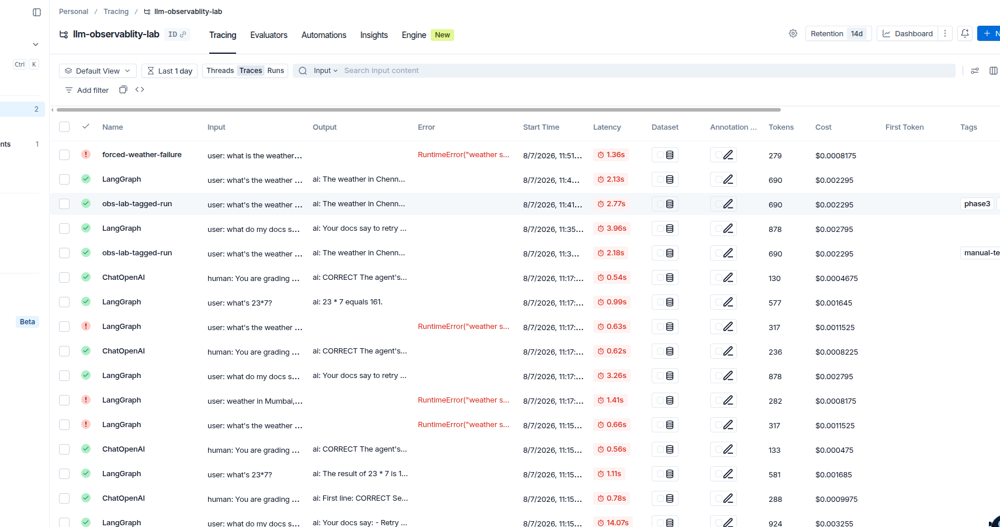
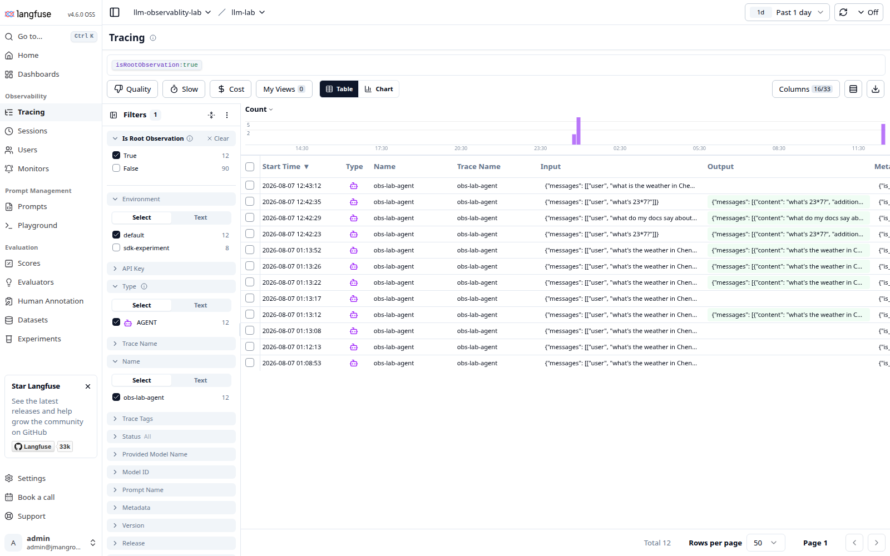
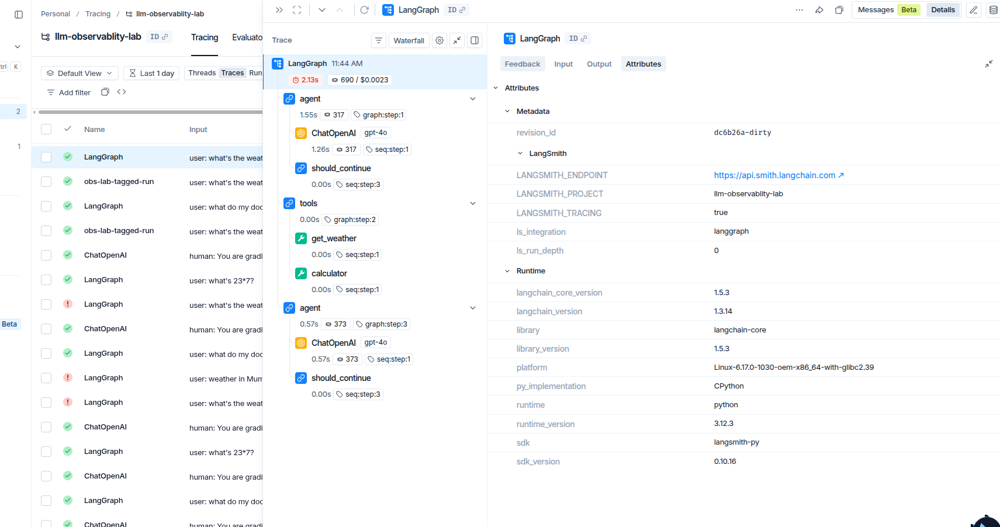
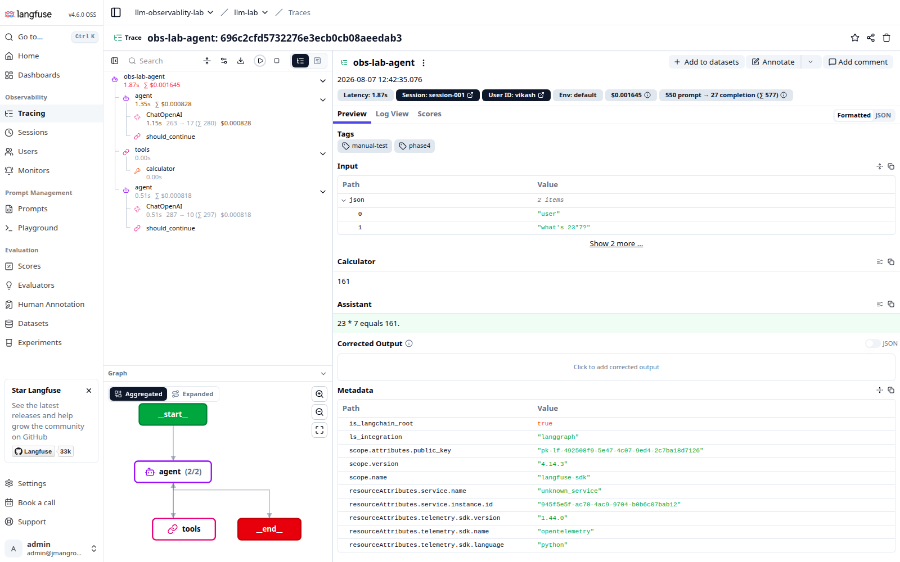
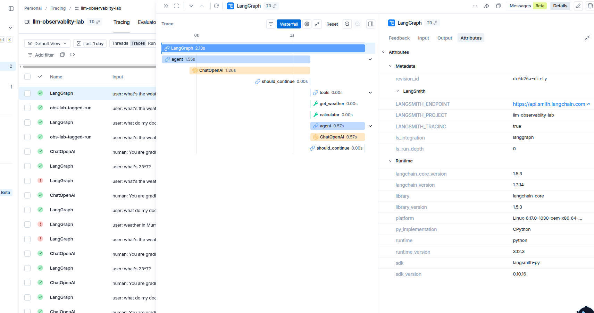
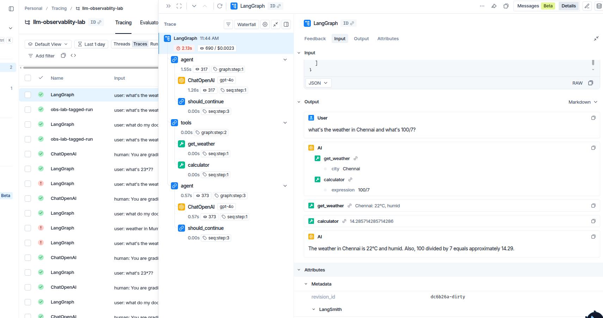
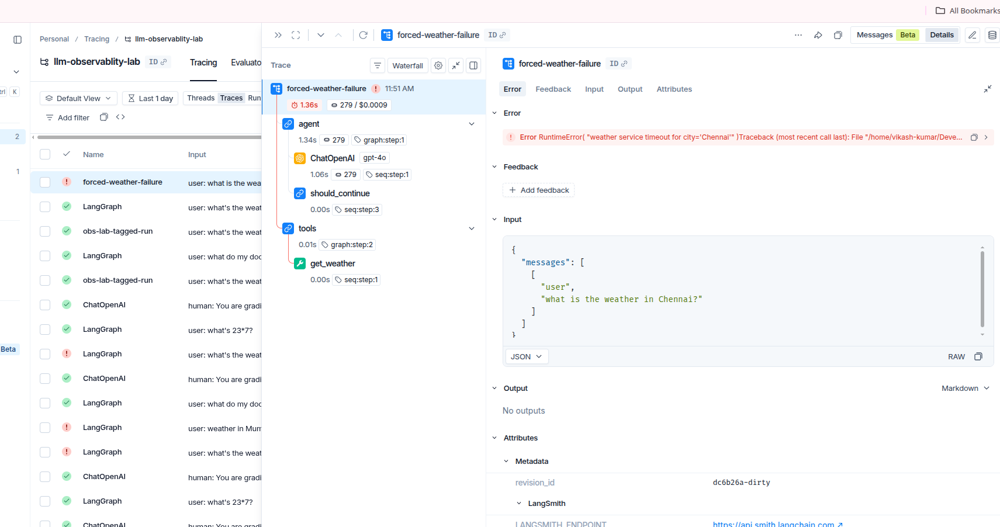
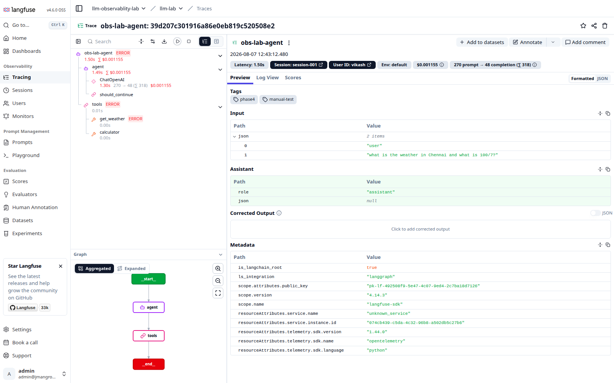
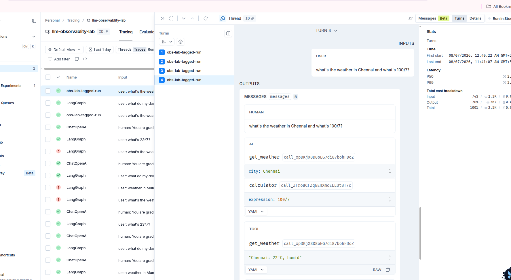
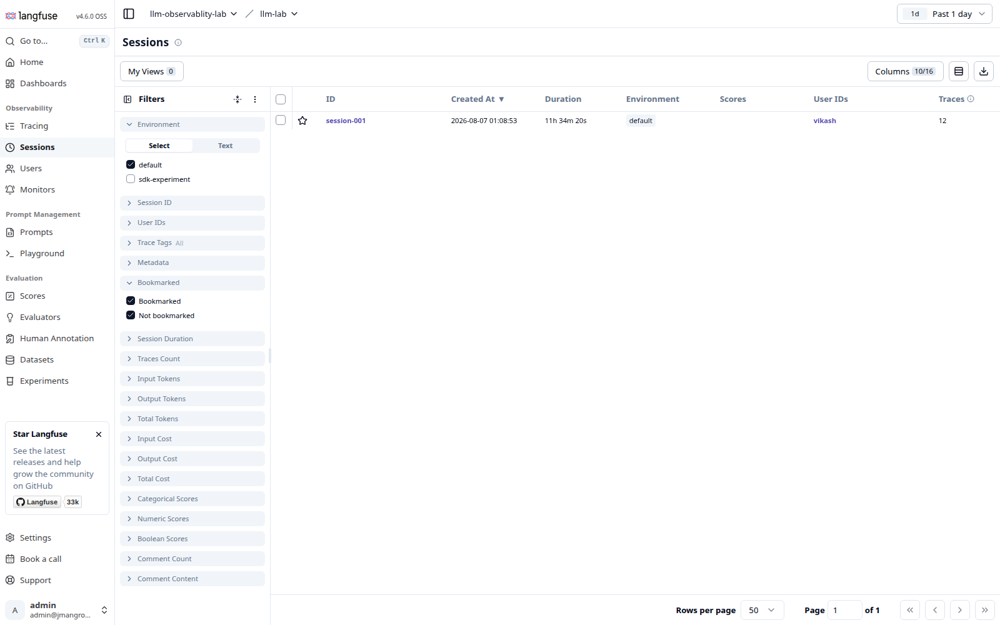

# Tracing and debugging

How each tool is switched on, what a run looks like, and what happens when the agent breaks.

## Turning tracing on

This is the biggest difference, and it is visible in the code.

### LangSmith: one environment variable

```bash
LANGSMITH_TRACING=true
```

That is it. No imports, no code changes, nothing passed into the agent.

Proof is in the run list. The rows named `LangGraph` came from running the plain app:

```bash
uv run python -m src.agent "what's the weather in Chennai and what's 100/7?"
```

That file does not mention LangSmith anywhere. It still shows up with full latency, token and cost data.



Look at the columns you get for free: `Latency`, `Tokens`, `Cost`, `Error`, `Tags`. The red rows are the weather tool failing. Nobody wrote error handling to make those appear.

### Langfuse: one handler per call

```python
handler = CallbackHandler()
graph.invoke(..., config={"callbacks": [handler]})
```

Nothing is recorded unless you pass that handler.



**Which is better depends on what you care about.** LangSmith gets you tracing in ten seconds, but it also captures everything in the process, including code you did not write. Langfuse costs you a line at every call site, and in exchange nothing leaves the process unless you asked for it.

One useful side effect: with both sets of keys in `.env`, a single run lands in **both** tools at once. Worth doing once.

---

## What a single run looks like

Both give you the same core thing: a tree of what happened, with time and tokens on each node.

**LangSmith**



`2.13s`, `690` tokens, `$0.0023` at the root. The `graph:step` and `seq:step` labels come from LangGraph and show the execution order.

**Langfuse**



Same shape, plus a rendered graph of the agent loop underneath the tree.

### Timing view

LangSmith has a waterfall that makes it obvious where the time actually went:



The whole run is 2.13s and the `ChatOpenAI` call is 1.26s of it. Both tool calls are 0.00s. The model is the slow part, not your code. That is nearly always the answer, and it is worth seeing once.

### The conversation itself



Both tools show the full message flow: what the model asked for, what each tool returned, what came back at the end.

---

## When something breaks

This is where the two tools genuinely differ, and it matters more than any feature list.

**LangSmith** marks the root of the trace and puts the full Python traceback in a dedicated `Error` tab. Output says `No outputs`.



**Langfuse** marks every span the error passed through, all the way up.



Read the Langfuse tree carefully:

```
obs-lab-agent   ERROR
  agent
    ChatOpenAI            1.30s   270 -> 48   $0.001155
    should_continue
  tools           ERROR
    get_weather   ERROR   0.00s
    calculator            0.00s
```

`get_weather` failed, so `tools` is marked, so the whole trace is marked. `calculator` sits right next to it, untouched and green. The graph below even paints `__end__` red.

**Verdict on errors: Langfuse wins.** LangSmith tells you *that* the run failed and hands you a traceback. Langfuse shows you *where* in the agent it failed without you reading a single line of Python.

One detail worth knowing: `get_weather` shows `0.00s`. A real network timeout would take seconds. Zero means it failed on the first line of the function. That is how you tell a fake failure from a real one.

---

## Grouping runs together

Both can thread separate runs into one conversation.

**LangSmith** calls them Threads:



**Langfuse** calls them Sessions:



One session, `session-001`, holding 12 traces over 11 hours, attributed to user `vikash`.

That 11 hour duration is a warning, not a feature. The session ID is hardcoded in [traced_run.py](../src/obs_langfuse/traced_run.py), so every run ever executed piles into the same session. In a real app you generate one per conversation.

The two tools name these fields differently:

| | LangSmith | Langfuse |
|---|---|---|
| Tags | `config["tags"]` | `metadata["langfuse_tags"]` |
| User | `metadata["user_id"]`, any key you like | `metadata["langfuse_user_id"]`, reserved name |
| Session | `metadata["session_id"]`, any key you like | `metadata["langfuse_session_id"]`, reserved name |

LangSmith lets you invent your own keys and filter on them. Langfuse only promotes specific `langfuse_`-prefixed keys into real UI features, and treats everything else as plain metadata. You trade magic strings for purpose-built screens.

---

---

[Index](README.md) · [Tracing](01-tracing.md) · [Evaluation](02-evaluation.md) · [Features](03-features.md) · [Cost](04-cost.md)
