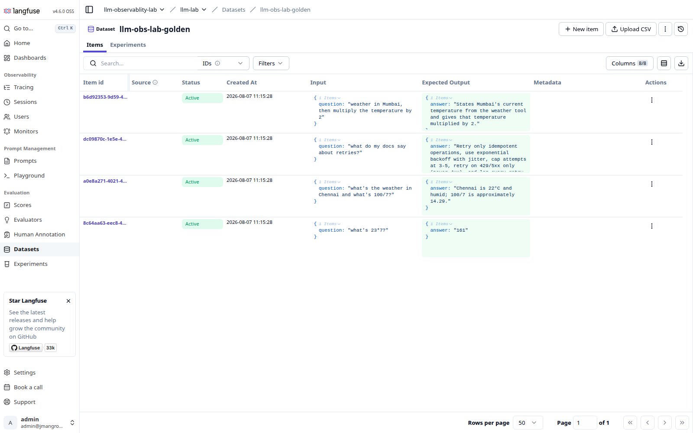
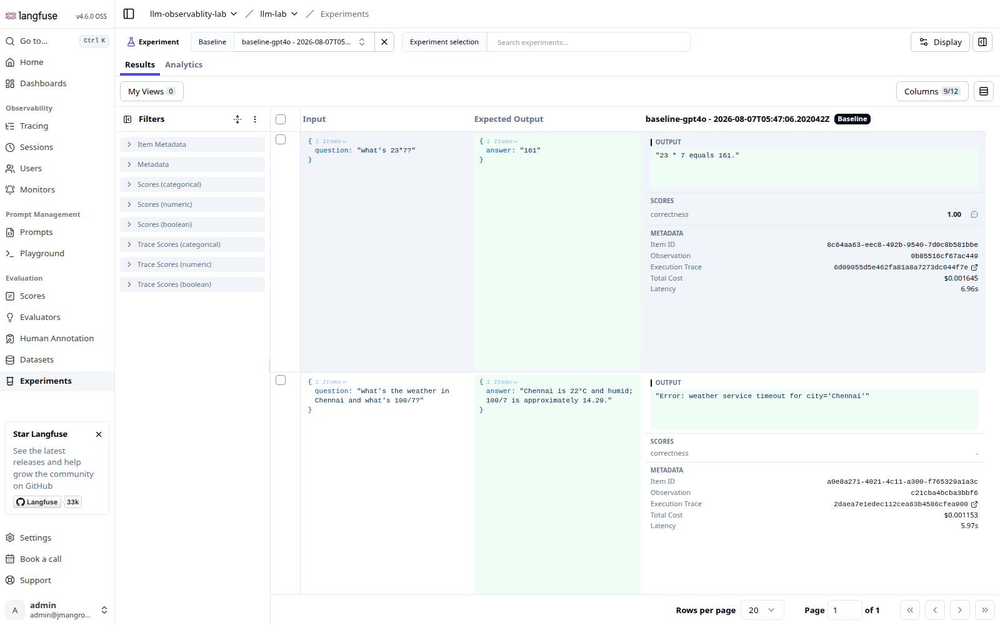
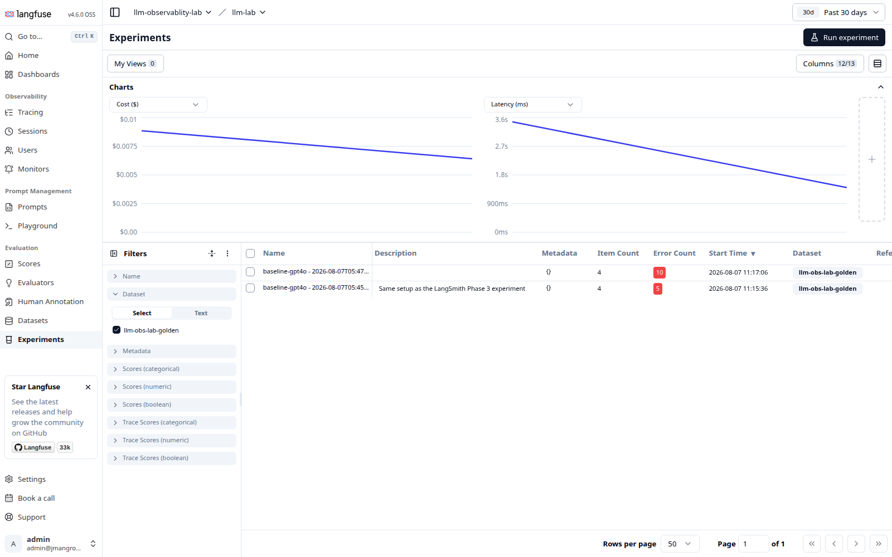
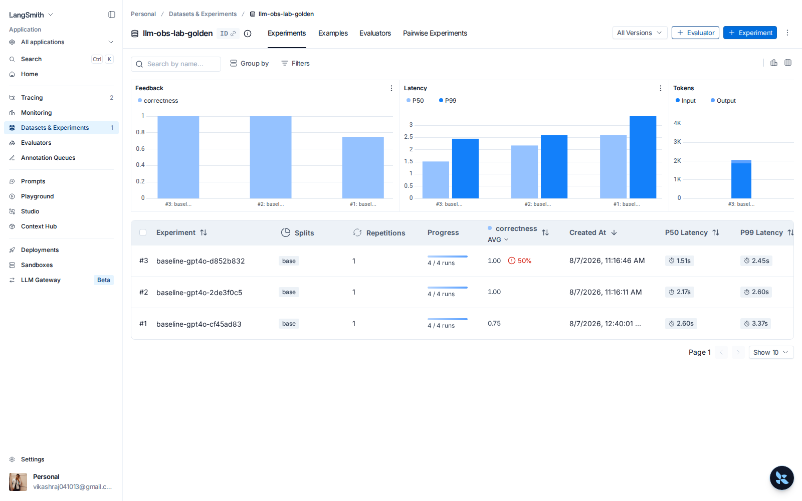

# Datasets and evaluation

Running the same four golden questions through both tools with an LLM judge.

## Datasets and evaluation

Both hold a golden dataset and run your agent against it with an LLM judge.

The exact same four questions were loaded into both, imported from one Python list, so the comparison is fair.



Running the experiment gives you per-item results:



Each row shows the question, the expected answer, what the agent actually said, the `correctness` score, cost, latency, and a link straight to the execution trace.

Note the second row. The agent output is `"Error: weather service timeout for city='Chennai'"` and the score is blank. **The failed case is still in the results.** It is not hidden.

And across runs:



Both runs show `Item Count 4`. The `Error Count` column (10 and 5) is how you spot a flaky agent at a glance.

LangSmith gives you the same thing with more charting on top:



Three experiments, each `4 / 4 runs`, with average `correctness` of `1.00`, `1.00` and `0.75`, plus P50 and P99 latency per experiment. The red `50%` badge on `baseline-gpt4o-d852b832` is the forced-failure run. LangSmith surfaces error rate as a first class column next to the score, which is the fastest way to tell "my agent is wrong" apart from "my agent is broken".

The charts along the top (Feedback, Latency, Tokens) update as you add experiments, so regressions between runs are visible without opening anything.

### The one real advantage Langfuse has here

Langfuse evaluators return an object with a `comment` field, so the judge explains itself:

```python
return Evaluation(name="correctness", value=0.0, comment="Did not give the temperature.")
```

LangSmith evaluators return a bare `bool`. A `0.0` tells you it failed but not why. You can work around it, but Langfuse gives it to you by default.

---

## Real numbers from the evaluation

Pulled from the LangSmith API, not typed by hand.

**Clean run, everything succeeded:**

| Question | Score | Cost |
|---|---|---|
| weather in Mumbai, then multiply the temperature by 2 | **0.0** | $0.00278 |
| what do my docs say about retries? | 1.0 | $0.00290 |
| what's 23*7? | 1.0 | $0.00168 |
| what's the weather in Chennai and what's 100/7? | 1.0 | $0.00230 |

3 out of 4. The Mumbai case genuinely failed the judge. That is the eval doing its job.

**Same dataset with the weather tool forced to fail every time:**

| Question | Result | Score |
|---|---|---|
| weather in Mumbai, then multiply the temperature by 2 | **ERROR** | none |
| what do my docs say about retries? | ok | 1.0 |
| what's 23*7? | ok | 1.0 |
| what's the weather in Chennai and what's 100/7? | **ERROR** | none |

**Both tools behave the same way here, and this corrects a common assumption.** Neither aborts the experiment. Both keep all 4 rows. Both leave the score empty on the failed ones.

The only difference is in Python. Langfuse drops failed items from the `result.item_results` list, so the script prints `experiment finished: 2 items` even though the UI correctly shows 4. If you log that number and never look at the UI, you will think your dataset shrank. LangSmith keeps all 4 in the returned results, but then runs your evaluator on the failed row too, which throws a second error unless you guard it:

```python
answer=outputs.get("answer", "")   # not outputs["answer"]
```

---

---

[Index](README.md) · [Tracing](01-tracing.md) · [Evaluation](02-evaluation.md) · [Features](03-features.md) · [Cost](04-cost.md) · [Scale](05-scale.md)
