# Dashboards and feature gaps

Where the two stop being the same kind of product.

## Dashboards

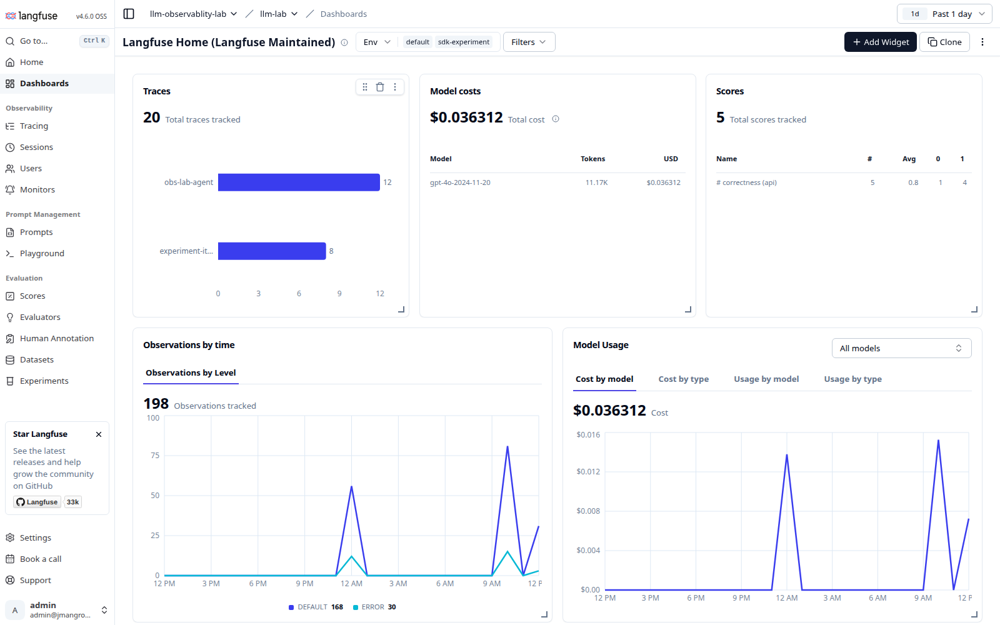

20 traces, `$0.036312` total, 11.17K tokens, 198 observations split `DEFAULT 168 / ERROR 30`, and average score `0.8`.

That error split is the single most useful number on the page. 30 out of 198 observations errored, which is the flaky weather tool showing up as a metric instead of a surprise.

LangSmith calls this Monitoring, and it goes deeper:

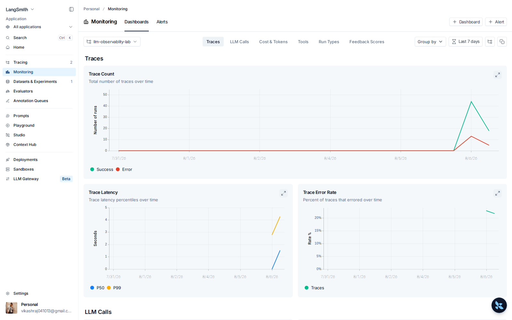

Tabs for Traces, LLM Calls, Cost & Tokens, Tools, Run Types and Feedback Scores. Trace Count is split into Success and Error lines, and there is a dedicated Trace Error Rate chart.

Note the second tab at the top: **Alerts**. LangSmith can notify you when error rate or latency crosses a threshold.

Langfuse has Monitors for the same idea:

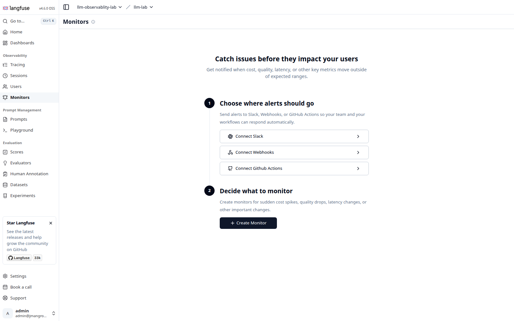

---

## What each tool has that the other does not

Up to here the two have been close. This is where they stop being the same kind of product.

**LangSmith is turning into a platform for building and running agents. Langfuse is an observability and evaluation tool.** That is the honest summary, and it cuts both ways.

Side by side, straight from the two menus:

| Feature | LangSmith | Langfuse |
|---|:---:|:---:|
| Tracing | yes | yes |
| Dashboards and charts | yes (Monitoring) | yes |
| Alerts on thresholds | yes | yes (Monitors) |
| Datasets and experiments | yes | yes |
| LLM-as-judge evaluators | yes | yes |
| Human annotation | yes (Annotation Queues) | yes |
| Prompt management | yes | yes |
| Prompt playground | yes | yes |
| Grouping runs | Threads | Sessions |
| **Per-user cost tracking** | no dedicated page | **yes** |
| **Self-hosting** | no | **yes** |
| **Visual agent debugger** | **Studio** | no |
| **Agent hosting** | **Deployments** | no |
| **Code sandboxes** | **Sandboxes** | no |
| **LLM proxy** | **LLM Gateway** | no |
| **Context Hub** | **yes** | no |

### Studio, the one people actually mean

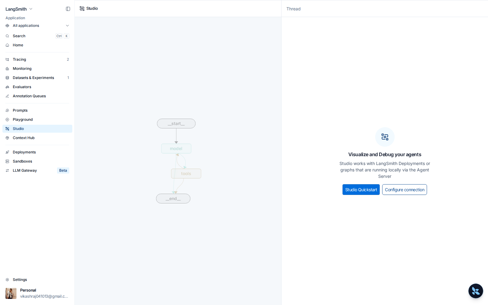

Studio draws your graph (`__start__ → model → tools → __end__`) and lets you run it step by step, inspect state at each node, and edit that state before continuing. It connects to either a LangSmith Deployment or a graph running locally through the Agent Server.

This is the biggest single gap. Langfuse can show you a graph of a run that **already happened**. Studio lets you drive the graph **while it runs**, stop it mid-loop and change the state. Those are different jobs. If you build in LangGraph, Studio is a genuine reason to keep LangSmith even if your traces live elsewhere.

### Deployments

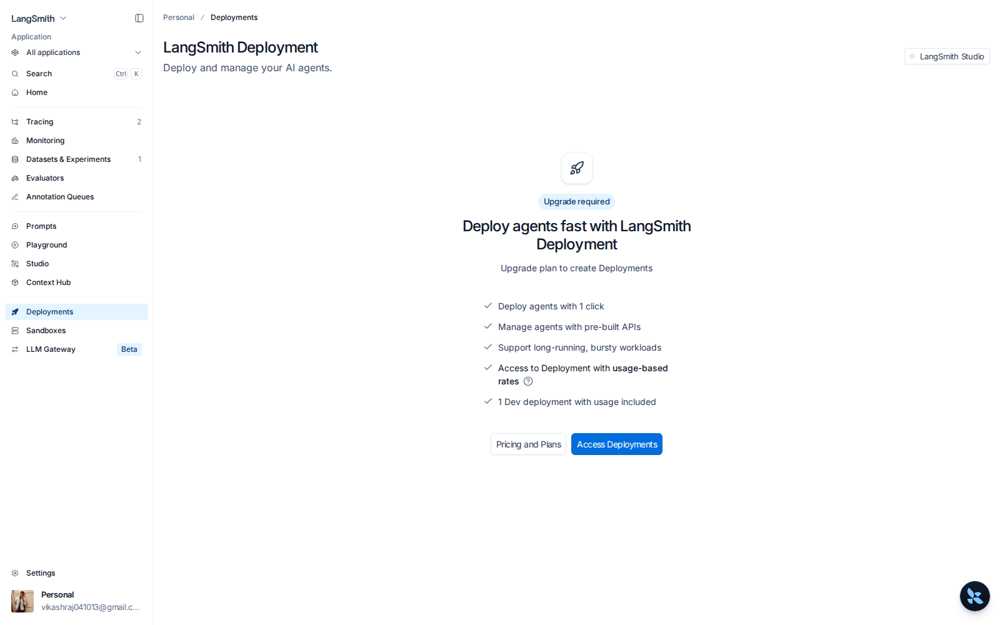

One-click agent hosting with pre-built APIs, built for long-running and bursty workloads. Note the `Upgrade required` badge: this is a paid tier, not something you get on the free plan.

### Sandboxes

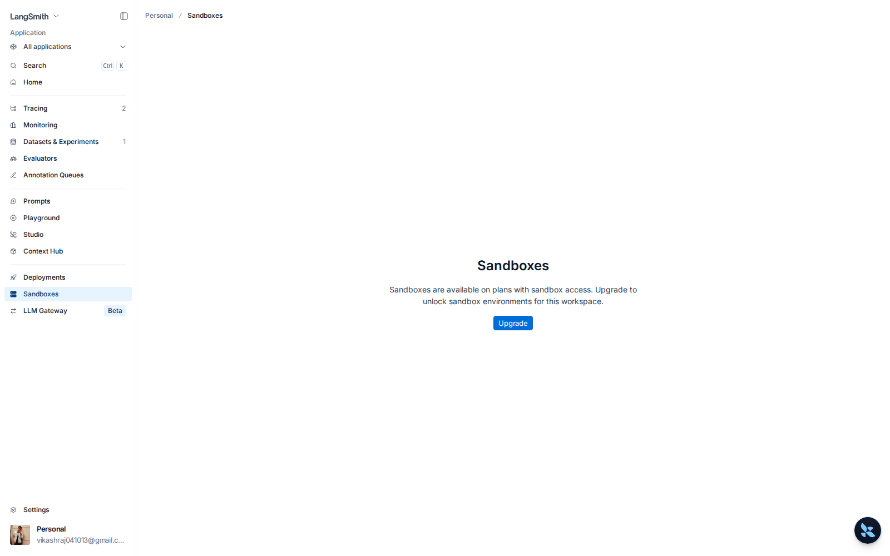

Isolated environments for agents that execute code. Also paid.

### LLM Gateway (Beta)

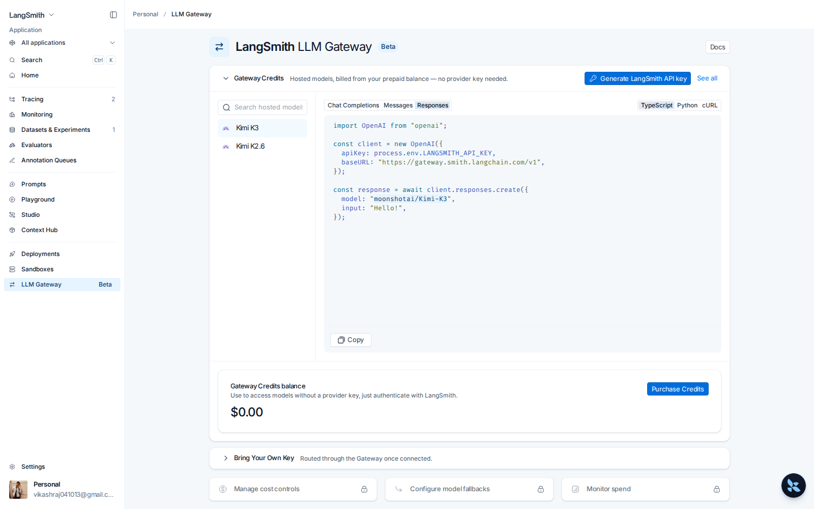

A proxy in front of model providers. You authenticate to LangSmith instead of holding provider keys, and it handles cost controls, model fallbacks and spend monitoring. Point your OpenAI client at `https://gateway.smith.langchain.com/v1` and it works unchanged.

For this lab that is directly relevant. The agent currently talks to Azure AI Foundry using a key in `.env`. The Gateway is the alternative to managing that key yourself.

### What Langfuse has that LangSmith does not

**Self-hosting is the headline** and the reason this lab runs Langfuse at all. Your traces, prompts and eval results never leave your network. For anything under a data residency rule, that single fact outweighs the entire feature list above.

**Per-user cost tracking gets its own page:**

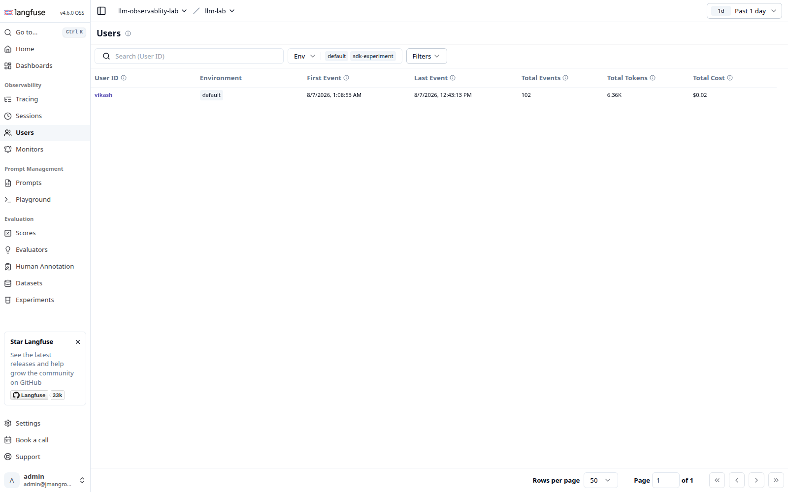

User `vikash`, 102 events, 6.36K tokens, `$0.02` spent. LangSmith stores `user_id` as ordinary metadata you can filter on. Langfuse aggregates it into a real screen. If you need to know what a specific customer costs you, Langfuse answers it in one click.

**Evaluators run against live production traces, configured in the UI:**

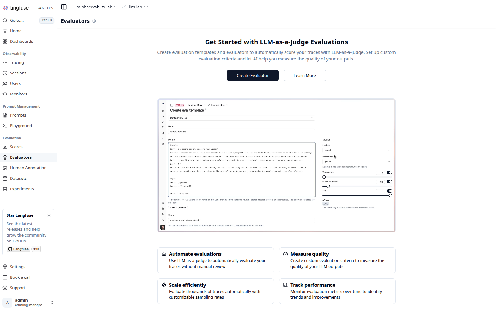

You build the judge template in a form (prompt, model, temperature, sampling rate) and it scores real traffic automatically. No code, no dataset required. LangSmith has evaluators too, but the Langfuse version is aimed squarely at continuous scoring of production traces rather than at offline dataset runs.

**Prompt management and Playground** exist on both sides, so neither wins here:

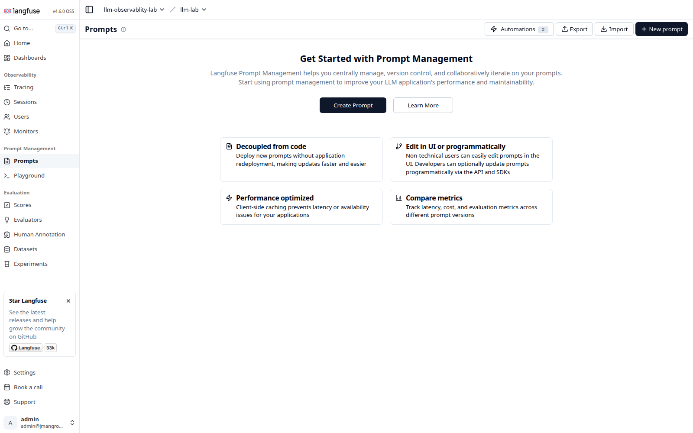

Langfuse Playground:

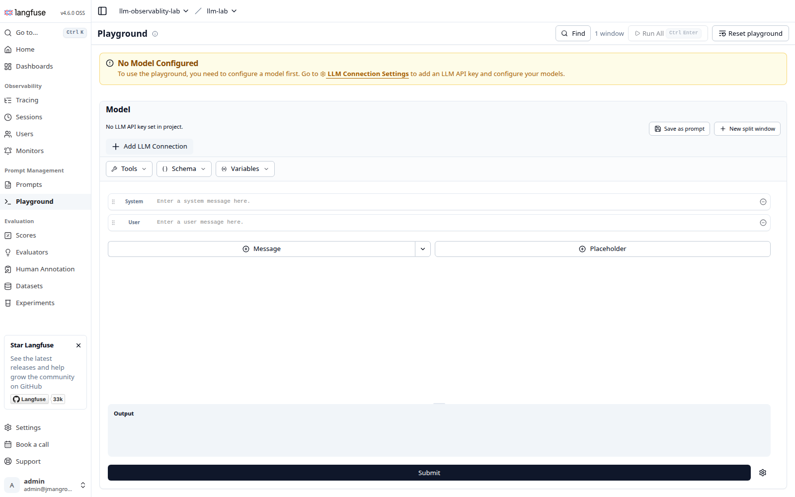

LangSmith Playground:

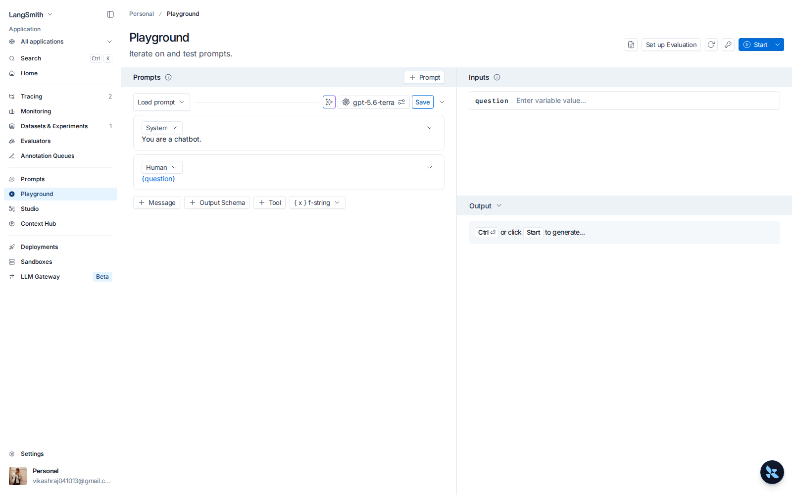

### How to choose

- Building on LangGraph and you want to debug agents visually, host them, or proxy your models? **LangSmith**, and it is not close. Studio alone decides it.
- Data cannot leave your network, or you need per-user cost attribution, or you want judges scoring live traffic without writing code? **Langfuse**.
- Just want to see what your agent did and score it against a dataset? Either. They are close enough that the deciding factor is hosting, not features.

---

---

[Index](README.md) · [Tracing](01-tracing.md) · [Evaluation](02-evaluation.md) · [Features](03-features.md) · [Cost](04-cost.md) · [Scale](05-scale.md) · [Feature matrix](06-feature-matrix.md) · [Cost model](07-cost-model.md)
